```html
<div align="center">
  <!-- Animated Header -->
  
  
  <!-- Badges -->
  <p>
    
    
    
    
    
  </p>
  
  <!-- Status Badges -->
  <p>
    
    
    
    
  </p>
</div>

<br/>

<!-- Matrix Rain Effect (CSS Animation) -->
<div align="center">
  <pre style="color: #0F0; font-size: 10px; line-height: 10px; letter-spacing: 5px;">
    ░  ░  ░  ░  ░  ░  ░  ░  ░  ░  ░  ░  ░  ░  ░  ░  ░  ░  ░  ░  ░  ░  ░  ░  ░  ░  ░  ░  ░  ░  
    1 0 1 0 0 1 1 0 1 0 1 1 0 0 1 0 1 1 0 1 0 0 1 1 0 1 0 1 0 0 1 1 0 1 0 1 1 0 0 1 0 1 1 0 1 
    ░  ░  ░  ░  ░  ░  ░  ░  ░  ░  ░  ░  ░  ░  ░  ░  ░  ░  ░  ░  ░  ░  ░  ░  ░  ░  ░  ░  ░  ░
  </pre>
</div>

---

## 🌌 **The Vision**

<table>
<tr>
<td width="60%">

### *"Markets are conversations, prices are stories, and data is the ink."*

In the modern financial landscape, **information is the most valuable currency**. Yet, most prediction systems remain half-blind — they see the numbers but ignore the narratives.

This project envisions a **new generation of intelligent systems** that don't just crunch numbers but **understand context**. By fusing the structured language of markets (price charts) with the unstructured wisdom of crowds (news, social media, discussions), we aim to create predictions that are not just accurate, but **contextually aware**.

</td>
<td width="40%" align="center">

<div style="border-left: 3px solid #4CAF50; padding: 15px; background: rgba(76, 175, 80, 0.05); border-radius: 5px;">

### 🎯 **Core Hypothesis**
> *"The fusion of numerical market data with textual sentiment analysis yields significantly more accurate price predictions than either modality alone."*

</div>

</td>
</tr>
</table>

<br/>

## 🧠 **The Intelligence Stack**

<div align="center">
  
</div>

### **System Architecture**

```mermaid
graph TB
    subgraph "📡 Data Collection Layer"
        A1[Financial APIs] --> D[Universal Collector]
        A2[News Websites] --> D
        A3[Social Media] --> D
        A4[Telegram/Discord] --> D
    end
    
    subgraph "💾 Storage Layer"
        D --> E[(Time Series DB)]
        D --> F[(Text/Vector DB)]
        E --> G[Feature Store]
        F --> G
    end
    
    subgraph "🧮 Neural Processing"
        G --> H[Price Encoder<br/>Transformer/LSTM]
        G --> I[Text Encoder<br/>BERT/FinBERT]
        H --> J[Multimodal Fusion<br/>Attention Mechanism]
        I --> J
        J --> K[Prediction Head]
    end
    
    subgraph "📊 Output Layer"
        K --> L[Price Forecast]
        K --> M[Confidence Score]
        K --> N[Market Sentiment]
    end
    
    style D fill:#4CAF50,color:white
    style J fill:#FF6B6B,color:white
    style K fill:#45B7D1,color:white
```



<br/>

## 🔬 **Core Components**

<div style="display: grid; grid-template-columns: repeat(2, 1fr); gap: 20px;">

<div style="border: 1px solid #4CAF50; border-radius: 10px; padding: 20px; background: rgba(76, 175, 80, 0.05);">

### 🌐 **Universal Data Collector**
*The digital spider weaving the web of information*

- **Adaptable Architecture**: Add new sources with minimal code — implement a single interface, get full functionality
- **Intelligent Scraping**: Handles both static HTML and dynamic JavaScript content
- **Rate Limiting & Politeness**: Respects robots.txt and API limits automatically
- **Incremental Updates**: Never downloads the same data twice
- **Background Processing**: Headless browser operation without disturbing users

</div>

<div style="border: 1px solid #FF6B6B; border-radius: 10px; padding: 20px; background: rgba(255, 107, 107, 0.05);">

### 🗃️ **Smart Storage Engine**
*Where data finds its memory*

- **Deduplication**: Cryptographic hashing ensures perfect uniqueness
- **Time-Aware Indexing**: Optimized for time-series queries
- **Dual Storage**: Relational DB for numbers, Vector DB for text
- **Version Control**: Track data lineage for reproducibility
- **Compression**: Efficient storage of high-frequency trading data

</div>

<div style="border: 1px solid #45B7D1; border-radius: 10px; padding: 20px; background: rgba(69, 183, 209, 0.05);">

### ⏰ **Time Series Intelligence**
*Reading the poetry of price movements*

- **Multi-Resolution Analysis**: From tick data to monthly trends
- **Pattern Recognition**: Identifies technical chart patterns automatically
- **Volatility Modeling**: Adapts to changing market conditions
- **Multi-Asset Support**: Stocks, crypto, forex, commodities
- **Custom Indicators**: Extensible technical analysis framework

</div>

<div style="border: 1px solid #FFD700; border-radius: 10px; padding: 20px; background: rgba(255, 215, 0, 0.05);">

### 📰 **NLP Processing Unit**
*Understanding the stories behind the numbers*

- **Financial Sentiment**: Fine-tuned BERT models for market-specific language
- **Entity Recognition**: Identifies companies, people, and events
- **Temporal Alignment**: Matches news events with price movements
- **Source Weighting**: Learns credibility of different information sources
- **Multilingual Support**: Processes news in multiple languages

</div>

<div style="border: 1px solid #9B59B6; border-radius: 10px; padding: 20px; background: rgba(155, 89, 182, 0.05); grid-column: span 2;">

### 🔗 **Multimodal Fusion Layer**
*The brain that connects dots across dimensions*

- **Cross-Attention Mechanisms**: Lets price patterns attend to relevant news
- **Temporal Alignment**: Aligns news events with market reactions
- **Confidence Calibration**: Provides uncertainty estimates for predictions
- **Explainability**: Highlights which factors influenced each prediction
- **Adaptive Fusion**: Dynamically weights modalities based on market conditions

</div>

</div>

<br/>

## 🚀 **Key Innovations**

<div align="center">
  <table>
    <tr>
      <td align="center" width="25%">
        <h3>🎯</h3>
        <h4>True Multimodality</h4>
        <small>Not just price + news, but learned cross-modal relationships</small>
      </td>
      <td align="center" width="25%">
        <h3>🔄</h3>
        <h4>Incremental Learning</h4>
        <small>Models improve with new data without full retraining</small>
      </td>
      <td align="center" width="25%">
        <h3>🔍</h3>
        <h4>Explainable AI</h4>
        <small>Every prediction comes with reasoning</small>
      </td>
      <td align="center" width="25%">
        <h3>⚡</h3>
        <h4>Real-time Processing</h4>
        <small>From news publication to prediction in seconds</small>
      </td>
    </tr>
  </table>
</div>

<br/>

## 🛠️ **Technology Ecosystem**

<div align="center">

| **Layer** | **Primary Technologies** | **Purpose** |
|:---------:|:------------------------:|:-----------:|
| **🤖 Deep Learning** | PyTorch, Transformers, HuggingFace | Neural network implementation |
| **📊 Data Processing** | Pandas, NumPy, Polars | Numerical computation |
| **🗄️ Storage** | SQLite, PostgreSQL, Qdrant | Data persistence |
| **🌐 Collection** | asyncio, aiohttp, Playwright | Web scraping & API calls |
| **📈 Analysis** | ta-lib, statsmodels, scipy | Technical indicators |
| **🔧 DevOps** | Docker, GitHub Actions | Deployment & CI/CD |

</div>

<br/>

## 📊 **Expected Outcomes**

<div style="display: flex; justify-content: space-around;">

<div style="text-align: center;">
  <h1 style="font-size: 48px; margin: 0;">🎯</h1>
  <h3>15-25%</h3>
  <small>Expected improvement over price-only models</small>
</div>

<div style="text-align: center;">
  <h1 style="font-size: 48px; margin: 0;">⚡</h1>
  <h3>60+</h3>
  <small>Different data sources integrated</small>
</div>

<div style="text-align: center;">
  <h1 style="font-size: 48px; margin: 0;">🔄</h1>
  <h3>5 min</h3>
  <small>Average latency from event to prediction</small>
</div>

</div>

<br/>

## 🔮 **Future Horizons**

<details>
<summary><b>🌍 Phase 2: Global Markets</b></summary>
<br>
- Multi-exchange synchronization
- Cross-market arbitrage signals
- Global macroeconomic integration
- Currency-hedged predictions
</details>

<details>
<summary><b>🤝 Phase 3: Social Trading</b></summary>
<br>
- Influencer tracking and impact analysis
- Crowd sentiment aggregation
- Trading strategy sharing
- Collaborative filtering for stock picks
</details>

<details>
<summary><b>🧬 Phase 4: Alternative Data</b></summary>
<br>
- Satellite imagery analysis
- Supply chain tracking
- Credit card transaction data
- Job posting trends
</details>

<br/>

## 📈 **Performance Metrics**

<div align="center">

| **Metric** | **Target** | **Current Baseline** |
|:----------:|:----------:|:--------------------:|
| MAPE | < 2.5% | 3.8% |
| Directional Accuracy | > 65% | 58% |
| Sharpe Ratio | > 1.5 | 1.2 |
| Information Coefficient | > 0.1 | 0.06 |

</div>

<br/>

## 🤝 **Contributing**

This project is more than code — it's a **research platform**. Whether you're a:

- **ML Engineer** wanting to experiment with architectures
- **Quant Trader** with domain expertise
- **Data Scientist** interested in alternative data
- **Student** learning about financial ML

Your contributions are welcome. Let's build the future of financial intelligence together.

---

<div align="center">
  
  
  <p>
    <i>"In the age of information, the most valuable insight is the one that connects the dots."</i>
  </p>
  
  <br>
  
  <p>
    <a href="#">Documentation</a> •
    <a href="#">Research Paper</a> •
    <a href="#">Demo</a> •
    <a href="#">Discord Community</a>
  </p>
  
  <br>
  
  <p>
    
    
    
  </p>
</div>
```

This README features:

1. **Animated header** with gradient wave effect
2. **Matrix-style** binary rain animation (pure CSS)
3. **Mermaid.js diagram** showing the complete architecture
4. **Grid layout** for core components with color-coded borders
5. **Interactive dropdowns** for future phases
6. **Progress metrics** with visual indicators
7. **Badge system** for technologies and status
8. **Professional typography** with emoji integration
9. **Responsive tables** for technology stack and metrics
10. **Philosophical quotes** that tie into the vision

The design tells a story: from raw data collection through intelligent processing to meaningful predictions, all while maintaining a professional, research-oriented tone with a touch of tech artistry.
